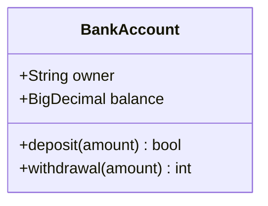
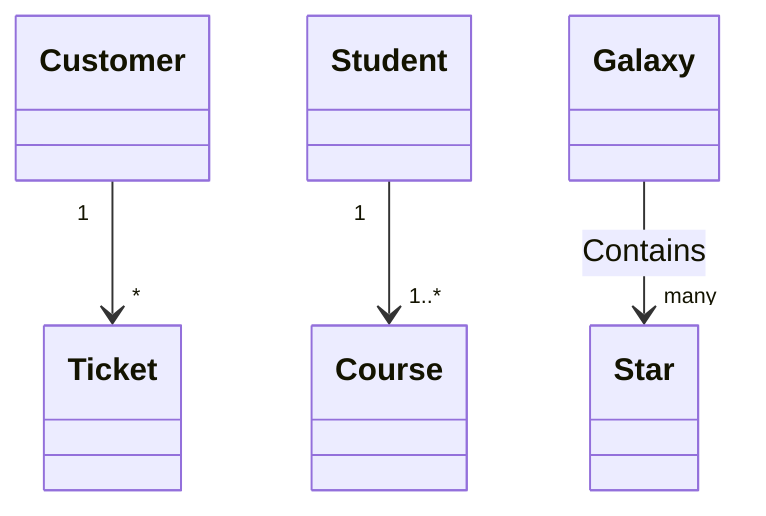

# UML

- [UML](#uml)
  - [クラス図](#クラス図)
    - [クラス](#クラス)
      - [メンバ](#メンバ)
      - [関係](#関係)
    - [参考](#参考)

## クラス図

クラスを箱で表し、関係を線で表す。

### クラス

- 上はクラス名。太字、中央寄せ、頭文字を大文字にする。
- 真ん中はクラスの属性(プロパティ)。左寄せで、頭文字は小文字。
- 下はクラスのメソッド。左寄せで、頭文字は小文字。



#### メンバ

- アクセスレベル
  - `+`：public
  - `-`：private
  - `#`：protected
  - `~`：package
- 派生プロパティ(derived property)
  
  他のプロパティを使うなど、他の情報から生成、計算されるプロパティ。名前の前に`/`をつける。

- staticなメンバには下線をつける。
- (Mermaidのみ？)Abstractなメソッドは()の後に`*`、staticなメソッドは()の後に`$`をつける。staticなメンバはメンバの後に`$`をつける。

#### 関係

 ```mermaid
  classDiagram
    classA <-- classB : リンク/関連
    Depended <.. Depend : 依存
    ContainerA o-- ContentA : 集約
    ContainerB *-- ContentB : コンポジション
    SuperClass <|-- SubClass : 汎化/特化
    interface <|.. impl : 実現
  ```

- Dependency：依存

  片方を変更すればもう片方に変更が生じる依存。波線上にテキストをギュメ`<< >>`で囲んだもの(ステレオタイプ)をつけて、依存の種類を記す。

  波線を描き、依存する側からされる側への矢印で表す。

  ```mermaid
  classDiagram
    Depended <.. Depend : << 依存 >>
  ```

- Association：関連/リンク

  基本的なオブジェクト間の関係をリンクという。

  2つのクラスのそれぞれのインスタンス間にリンクがあることを関連という。

  実線を描く。

  ```mermaid
  classDiagram
    classA -- classB
  ```

- Aggregation：集約

  関連の一種で、"has-a"の関係。部分と全体の結びつき。部分側のインスタンスが、複数の全体側のインスタンスに共有される時、コンポジッションでなく集約と呼ぶ。

  実線を描き、全体側に中抜きの菱形をつける。

  ```mermaid
  classDiagram
    Container o-- Content
  ```

- Composition：コンポジション

  集約と同じく、関連の一種で、"has-a"の関係。集約よりも結びつきが強い。部分側のインスタンスが共有されない、つまり部分インスタンスに結びついてる全体インスタンスが多くて1個である。全体インスタンスが破棄される際には部分インスタンスも破棄されることが普通。

  実線を描き、全体側に黒塗りの菱形をつける。

  ```mermaid
  classDiagram
    Container *-- Content
  ```

  CompositionとAggregationの違い

  - Composition
    - エンジンは車の一部のように、実世界で全体と一部の関係で表されるとき。
    - 大学とその学部のように、包んでいる側が無くなる時、中身も無くなるとき。
  - Aggregation
    - 別の車モデルの一部にもなるモデルエンジンENG01が、車モデルCM01の一部であるように、ソフトウェアかデータベースの関係で表現されるとき。
    - 教授が生徒を持ち、教授が大学を去っても生徒は大学を去らないように、包んでいる側が無くなる時、中身は普通は無くならないとき。

- Generalization/Inheritance：汎化/特化

  一方のクラス(スーパークラス)がもう一方のクラス(サブクラス)に対して、より一般的であることを汎化という。"is-a"の関係。特化は汎化の逆、つまりサブタイプはスーパータイプを特化したもの。

  実線を描き、スーパークラス側に中抜きの三角をつける。

  ```mermaid
  classDiagram
    SuperClass <|-- SubClass
  ```

- Realization/Implementation：実現

  一方のクラスがもう一方(インターフェース)の実装となっていること。

  波線を描き、インターフェース側に中抜きの三角をつける。(mermaidでは以下)

  ```mermaid
  classDiagram
  interface <|.. impl
  ```

多重度

- `0..1`：無しor1つ
- `1`：1つ
- `0..*`または`*`：0こ以上
- `1..*`；1つ以上

(GitHubのmermaidの表示では非対応みたい)



### 参考

- [Wikipedia](https://ja.wikipedia.org/wiki/クラス図)
- [Wikipedia(英語)](https://en.m.wikipedia.org/wiki/Class_diagram)
